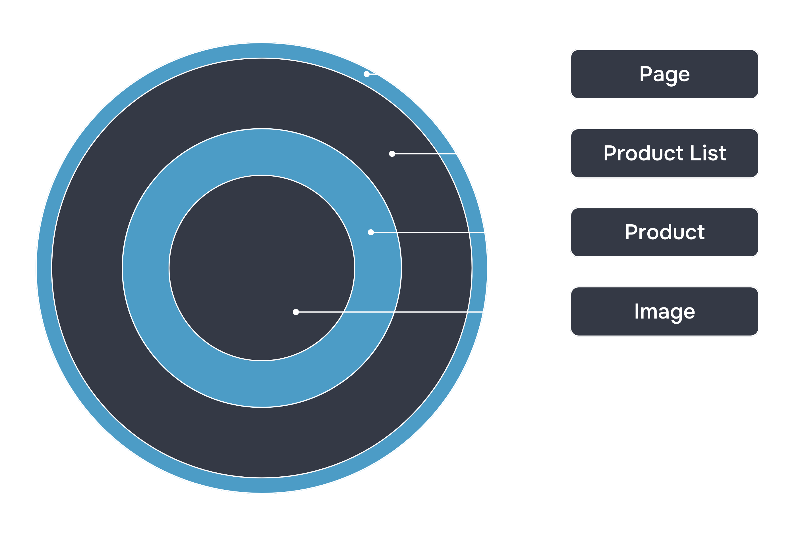

# Compoziția și extragerea componentelor în React

În lecția anterioară, am discutat despre ideea principală a React - componentele. Datorită lor, în React se dezvoltă aplicații mari și complexe, care sunt ușor de întreținut. 

În această lecție, vom analiza cum să utilizăm componentele împreună și cum să extragem elementele interfeței în componente.

## Compoziția componentelor

Forța React constă în posibilitatea de a încorpora unele componente în altele, care, la rândul lor, pot consta din componente și mai mici, și așa mai departe, până la cele mai primitive taguri HTML. 

Structura unei aplicații React seamănă cu o ceapă sau o planetă:



Această caracteristică a React permite utilizarea aceleiași abstracții la orice nivel al aplicației. 

Urmăriți: o componentă poate fi imaginea unui produs, cardul unui produs, lista de produse sau chiar întreaga pagină a categoriei de produse. Toate acestea sunt componente care conțin alte componente.

De exemplu, o pagină a unui magazin online poate fi reprezentată simplificat astfel:

```javascript
function Cart(props) {
	return <div>Coșul de cumpărături este gol</div>;
}

function Header(props) {
	return (
		<header>
			<h1>Magazinul de brânzeturi glazurate</h1>
			<Cart />
		</header>
	);
}

function Products(props) {
	// în această componentă va fi descrisă renderizarea listei de produse
}

function Filters(props) {
	// în această componentă va fi descrisă renderizarea filtrelor pentru produse
}

function Footer(props) {
	return <div>Compania există din 2008</div>;
}

function Shop() {
	return (
		<>
			<Header />
			<div
				style={{
					display: "flex",
					alignItems: "flex-start",
				}}>
				<Filters />
				<Products />
			</div>
			<Footer />
		</>
	);
}

const root = ReactDOM.createRoot(document.querySelector("#root"));
root.render(<Shop />);
```

Această capacitate a bibliotecii React face dezvoltarea interfețelor utilizatorilor rapidă și captivantă.

Componentele pot fi folosite de mai multe ori:

```javascript
function UserGreeting(props) {
	return <h1>Bună ziua, {props.fullName}</h1>;
}

function ProducerParty(props) {
	return (
		<div>
			<UserGreeting fullName="Stan Lee" />
			<UserGreeting fullName="Brian Michael Bendis" />
			<UserGreeting fullName="Jonathan Hickman" />
			<UserGreeting fullName="Peter David" />
			<UserGreeting fullName="Kurt Busiek" />
			<UserGreeting fullName="Ed Brubaker" />
		</div>
	);
}

const root = ReactDOM.createRoot(document.getElementById("root"));
root.render(<ProducerParty />);
```

În acest exemplu, i-am salutat personal pe regizorii de film.

## Extragerea componentelor

Încercați să împărțiți aplicația în părți. Astfel, va fi mai ușor de întreținut și dezvoltat.

Să presupunem că lucrăm la o anumită componentă `Order`:

```javascript
function Order(props) {
	return (
		<div className="Order">
			<div className="Customer">
				
				<div className="Customer-fullName">{props.customer.fullName}</div>
			</div>
			<div className="Order-total">{formatPrice(props.total)}</div>
			<div className="Order-date">{props.date}</div>
		</div>
	);
}
```

Această componentă este folosită pentru a afișa cardul comenzii în panoul de control al magazinului online. 

Ca props, primește un obiect de acest tip:

```json
{
    customer: {
        fullName: "Jordan Walke",
        picture: "https://avatars.githubusercontent.com/u/977348?v=4"
    }
    total: 23190,
    date: "22.02.2024 15:44"
}
```

Din cauza încorporării obiectelor în props, lucrul cu această componentă poate fi nu foarte convenabil. O astfel de componentă poate fi împărțită în componente mai mici. Să încercăm să extragem avatarul utilizatorului într-o componentă separată:

```javascript
function CustomerPicture(props) {
	return (
		
	);
}
```

După această îmbunătățire, codul componentei `Order` arată astfel:

```javascript
function Order(props) {
	return (
		<div className="Order">
			<div className="Customer">
				<CustomerPicture customer={props.customer} />
				<div className="Customer-fullName">{props.customer.fullName}</div>
			</div>
			<div className="Order-total">{formatPrice(props.total)}</div>
			<div className="Order-date">{props.date}</div>
		</div>
	);
}
```

Lucrul cu componenta `Order` a devenit mai convenabil, dar numele utilizatorului încă se obține din obiectul încorporat `props`. Să încercăm să simplificăm și mai mult `Order`. Pentru aceasta, vom combina informațiile despre cumpărător într-o singură componentă:

```javascript
function CustomerInfo(props) {
	return (
		<div className="Customer">
			{/* Folosim componenta pentru afișarea avatarului */}
			<CustomerPicture сustomer={props.сustomer} />
			<div className="Customer-username">{props.customer.fullName}</div>
		</div>
	);
}
```

A ieșit excelent! Acum componenta `Order` arată astfel:

```javascript
function Order(props) {
	return (
		<div className="Order">
			<CustomerInfo customer={props.customer} />
			<div className="Order-total">{formatPrice(props.total)}</div>
			<div className="Order-date">{props.date}</div>
		</div>
	);
}
```

În acest exemplu, am separat o unitate de date independentă din props și am creat pentru ea o componentă autonomă `CustomerInfo`.

Ar trebui să împărțiți componentele în componente mai mici dacă:

- aceeași funcționalitate este utilizată de mai multe ori: de exemplu, `Modal`, `Button`, `Avatar`;
- funcționalitatea componentei este complexă în sine: coșul de cumpărături și filtrele într-un magazin online, fluxul de știri în rețelele sociale.

În aplicațiile mari, este necesar să aveți un set de componente care sunt folosite de mai multe ori. Acest lucru permite reducerea timpului de dezvoltare, întreținere și actualizare a aplicației. În plus, atunci când actualizați o componentă care este utilizată de mai multe ori, cum ar fi `Button`, puteți fi siguri că `Button` se va schimba în toate locurile unde este folosită.

În această lecție, ați învățat să combinați componentele React între ele și să uniți în componente blocurile de interfață cu sens comun. În cadrul acestui curs, veți crea multe componente diferite și veți afla despre posibilitățile lor de interacțiune. În lecția următoare, vom analiza mai detaliat lucrul cu props.
