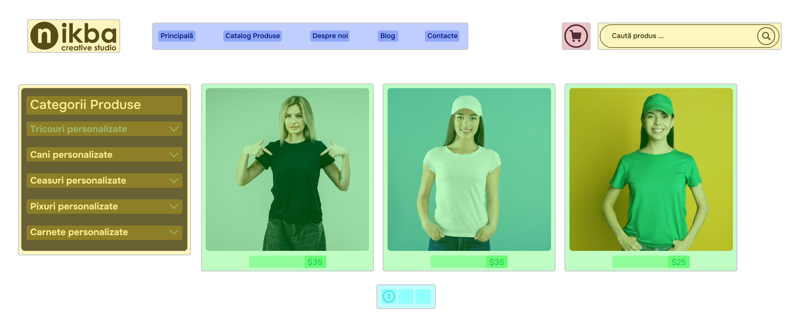

# Decompunerea UI

Esenta oricărei decompuneri este împărțirea unui lucru mare și complex în ceva mic și simplu. În această lecție, vom discuta despre cum decompunerea ajută la dezvoltarea interfețelor utilizatorilor.

## Decompunerea interfeței

Decompunerea interfeței este procesul de împărțire a aplicației în blocuri separate. Acest lucru permite adăugarea funcționalității, corectarea erorilor, reorganizarea UI și gestionarea componentelor aplicației independent una de alta. Separarea responsabilităților este una dintre cele mai importante sarcini în programare, iar de succesul său depinde fiabilitatea și scalabilitatea sistemului. 

Este aproape ca la Machiavelli: "Divide et impera".

Așa se poate vizualiza decompunerea interfeței în componente:

Aceasta este imaginea unui site web așa cum este văzută de un utilizator obișnuit.

Și așa o vede un dezvoltator React

Blocurile de aceeași culoare au o structură comună, dar conținut diferit. Putem descrie HTML, CSS și JavaScript comun pentru ele într-o singură componentă, să-i dăm un nume și apoi pur și simplu să o "invocăm" în locul potrivit, schimbând doar conținutul.

Dar cum să înțelegem dacă un element al interfeței ar trebui să devină o componentă? Când este momentul să împărțim o componentă în mai multe componente mai mici? De obicei, această decizie este luată de dezvoltator. 

Dar există și câteva reguli generale pentru decompunerea interfeței:

- Dacă aplicația se complică și codul componentelor în editor crește pe mai multe ecrane - este timpul să te gândești la decompunere.
- Urmați principiul DRY - Don't repeat yourself (nu te repeta). De exemplu, dacă codul unui buton se repetă, ar trebui să-l separați într-o componentă independentă și să-l utilizați în interiorul altor componente. Dacă mai târziu doriți să îmbunătățiți acest buton, modificările vor fi aplicate în toate locurile unde este folosit - acesta este sensul componentelor.
- Împărțiți mental aplicația în blocuri funcționale. De exemplu, într-un magazin online, acestea ar putea fi coșul de cumpărături, cardul produsului, filtrul, contul personal, subsolul site-ului, căutarea. Când împărțiți aplicația în părți, veți putea găsi mai rapid elementele repetitive și decompune interfața utilizatorului.
