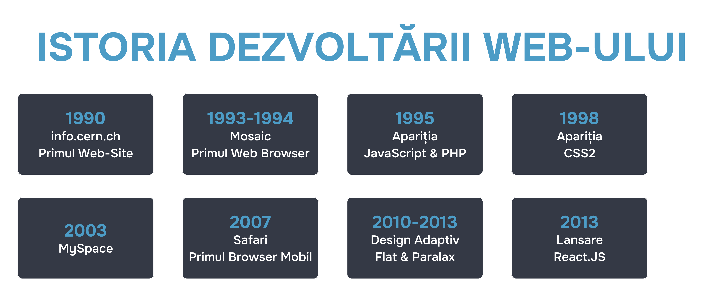

# Istoria creării React

Dacă ne imaginăm istoria dezvoltării web-ului ca un scurt plan, ar arăta astfel:



## Înainte de JavaScript
În acele vremuri îndepărtate, site-urile web erau generate în întregime pe server, tot marcajul era livrat browserului în formă finită și nu se schimba pe partea clientului. Dacă utilizatorul apăsa un buton, browserul cerea un nou marcaj de la server și pagina se reîncărca. Așa se întâmpla de fiecare dată când utilizatorul efectua orice acțiune pe site.

## După JavaScript și AJAX
După apariția acestor instrumente, site-urile au devenit interactive. JS permitea manipularea arborelui DOM, iar tehnologia AJAX permitea încărcarea datelor pe pagină în porțiuni, fără reîncărcare completă.
Puterea de calcul a calculatoarelor și telefoanelor creștea, iar clientul JS începea să efectueze operații tot mai complexe în browser. Programele au început să migreze treptat din versiuni desktop în versiuni web. Dar pentru scrierea aplicațiilor complexe, erau necesare încă multe eforturi.

## Biblioteci și frameworks
Atunci au început să apară biblioteci și frameworks. Una dintre primele a fost jQuery - un instrument puternic și elegant pentru acele timpuri. Dar chiar și cu acesta, scrierea aplicațiilor era destul de dificilă.
Problema era în abordarea imperativă a dezvoltării. Adăugarea de noi funcționalități în aplicațiile de atunci putea ușor să strice funcționalitatea existentă. Interdependența unor caracteristici față de altele era imensă, iar dezvoltarea necesita mult efort și timp. De exemplu, la dezvoltarea unui magazin online, era necesar să verificați dacă funcționalitatea contului personal nu a fost stricată după modificările din coș. Aceasta a fost o muncă extenuantă și minuțioasă.
Pentru a reduce durerea dezvoltatorilor în scrierea site-urilor și aplicațiilor complexe, au fost create primele frameworks: Backbone.js, Knockout.js și Ember.js. Dar, fiind frameworks și nu biblioteci, ele impuneau o anumită structură a aplicației și soluții arhitecturale. Dezvoltatorilor le-a luat mult timp să se obișnuiască cu noile modalități de scriere a codului. frameworksle, deși rezolvau o parte din probleme, totuși impuneau restricții asupra libertății de gândire a dezvoltatorilor în proiectarea site-urilor și aplicațiilor. În plus, din cauza abordării imperative, a apărut problema scalabilității aplicațiilor.

## Și atunci a apărut ea - biblioteca React
Totul s-a schimbat în 2013, când codul sursă al bibliotecii React a fost prezentat lumii.
Spre deosebire de un framework, biblioteca nu impune restricții asupra arhitecturii aplicației și oferă libertate de alegere: dezvoltatorul decide singur ce bibliotecă să folosească împreună cu React pentru rutare, gestionarea stării, interacțiunea cu serverul și așa mai departe. React poate fi aplicat practic în orice condiții și complexitatea stivei poate fi mărită doar dacă este necesar pentru funcționalitatea aplicației.
React are multe avantaje care îl fac să iasă în evidență față de alte biblioteci. 

Veți fi convins de acest lucru pe măsură ce începeți să lucrați cu biblioteca în cadrul cursului. Dar pentru moment, uitați-vă cât de elegant arată codul în React:


```javascript
//React.js

import React, { useState } from 'react';

function Counter() {
  const [count, setCount] = useState(0);
  return (
    <div>
      <p>Ai apăsat de {count} ori</p>
      <button onClick={() => setCount(count + 1)}>
        Apasă pe mine
      </button>
    </div>
  );
}
```

Comparați-l cu codul în Ember.js:

```html
//Ember.js

<div>
  <p>Ai apăsat de {{this.count}} ori</p>
  <button type="button" {{on "click" (fn this.change)}}>
    Apasă pe mine
  </button>
</div>
```

```javascript
import Component from '@glimmer/component';
import { tracked } from '@glimmer/tracking';
import { action } from '@ember/object';

export default class CounterComponent extends Component {
  @tracked count = 0;

  @action
  change() {
    this.count = this.count + 1;
  }
}
```

Sau, de exemplu, același cod în Backbone.js:

```javascript
//Backbone.js:

var Counter = Backbone.Model.extend({
    defaults: { value: 0 },
    add: function() {
        this.set({value: this.get('value')+1});
    }
});

var cnt = new Counter();

var CounterView = Backbone.View.extend({
    initialize: function() {
        this.model.on('change', this.render, this);
    },
    events:{
        'click .plus': 'add'
    },
    render: function() {
        var html='<div><p>Ai apăsat de '+ this.model.get('value')+' ori</p>';
        html += '<button class="plus">Apasă pe mine</button><div>';
        this.$el.html(html);
    },
    add: function() {
        this.model.add();
    }
});

var view = new CounterView({ model: cnt });
view.render();
```

Suportul codului în React pare o sarcină abordabilă chiar și pentru un începător, în timp ce pentru scalarea unei aplicații pe alte frameworks va fi necesar să petreceți cel puțin jumătate de zi singur cu documentația. Abordarea declarativă în dezvoltarea interfețelor utilizatorilor a făcut biblioteca React un instrument atât de convenabil și popular.
În lecțiile următoare, vom vorbi mai detaliat despre caracteristicile React.
