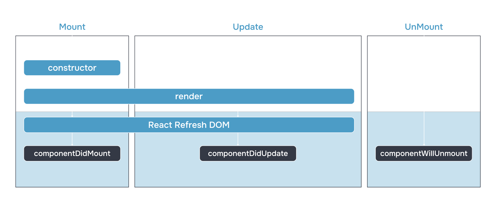

# Ciclul de viață al componentelor


În lecția anterioară, am discutat despre proprietățile și metodele suplimentare disponibile în componentele de clasă. Dar asta nu este tot - componentele de clasă au și câteva metode care permit controlul mai precis al logicii de funcționare și al randării.

În această lecție, veți învăța să controlați metoda `render()` a componentei și să o apelați doar atunci când anumite condiții sunt îndeplinite. De asemenea, veți dobândi abilitatea de a lucra cu gestionarii de evenimente în React și veți învăța cum să evitați scurgerile de memorie.

## Ce este ciclul de viață


Fiecare componentă de clasă are un ciclu de viață. Pentru a înțelege ce înseamnă asta, imaginați-vă un brad artificial de Crăciun: în decembrie este scos din pod, asamblat, împodobit cu jucării, iar după sărbătoare (în martie) este dezmembrat până la următorul An Nou. În mod similar se comportă și componentele. Fiecare componentă, pe parcursul ciclului său de viață, poate fi montată (eng. mount), actualizată (eng. update) și demontată (eng. unmount). Biblioteca React permite executarea codului la un anumit moment al acestui proces.

**Montarea** are loc când arborele HTML al componentei este inserat de motorul React în DOM.

**Actualizarea** se realizează într-unul din cele trei cazuri:

*   dacă a avut loc randarea componentei părinte,
*   dacă starea internă s-a schimbat ca rezultat al apelului `this.setState`,
*   dacă actualizarea este inițiată de apelul metodei încorporate `this.forceUpdate`.

**Demontarea** are loc când arborele HTML al componentei este eliminat din DOM.

Fiecărui dintre aceste evenimente îi corespunde una dintre cele trei metode ale ciclului de viață: `componentDidMount`, `componentDidUpdate` și `componentWillUnmount`:



_Puteți [descărca varianta interactivă a schemei de pe GitHub](https://github.com/wojtekmaj/react-lifecycle-methods-diagram). Acolo sunt reflectate metodele mai puțin populare de lucru cu ciclul de viață al componentelor și linkuri corespunzătoare către documentația React în limba rusă_

La fel ca și `render`, acestea sunt metode de callback. Spre deosebire de `setState`, nu este necesar să le apelați manual, ci este suficient să le descrieți în interiorul componentelor, pentru ca la momentul potrivit să fie apelate din interiorul motorului React - ca niște callback-uri.

Cel mai adesea, metodele ciclului de viață sunt folosite pentru a descrie efectele secundare (eng. side effects). Această noțiune este folosită pentru a denumi toate activitățile componentei legate de „lumea exterioară”: interacțiunea cu diferite API-uri, abonarea la evenimente, solicitarea de date de la server etc.

## Montarea: `componentDidMount`


Această metodă este apelată imediat după montarea componentei. În interiorul `componentDidMount`, puteți vă abona la evenimente:

```javascript
class VirtualList extends React.Component {
    state = { offsetY: 0 }
    componentDidMount() {
        document.addEventListener(
            'scroll', 
            ()=>this.setState({ offsetY: window.pageYOffset })
        )
    }
    // ...
} 
```

În acest exemplu, componenta se abonează la evenimentul de defilare (scroll) la montare și începe să înregistreze valoarea `pageYOffset` în starea sa internă.


În plus, metoda ciclului de viață `componentDidMount` este excelentă pentru interacțiunea cu serverul, de exemplu, pentru solicitarea de date:

```javascript
class Stories extends React.Component {
    state = { 
        stories: [],
        loading: true,
        hasError: false
    }

    componentDidMount() {
        fetch('/stories/all')
            .then(res => res.json())
            .then(data => this.setState({ stories: data.stories, loading: false }))
            .catch(e => this.setState({ ...this.state, loading: false, hasError: true }))
    }
    // ...
} 
```

În acest exemplu, la montarea componentei va fi efectuată o solicitare către server. Rezultatul solicitării va fi înregistrat în starea internă a componentei. Din starea internă, acesta va putea fi folosit ulterior pentru crearea unei structuri JSX. Rețineți că, pe lângă datele propriu-zise, starea conține și cheile `hasError` și `loading`. Utilizând aceste chei, vom putea afișa utilizatorilor structuri diferite cu ajutorul randării condiționale: un component de indicare a încărcării sau o eroare, în cazul în care răspunsul de la server nu a venit în forma așteptată.

## Actualizarea: `componentDidUpdate`


Metoda `componentDidUpdate()` este apelată imediat după actualizarea stării interne sau a prop-urilor. Dar nu poate fi apelată la montare.

În această metodă, puteți lucra cu arborele DOM real atunci când componenta se actualizează. De asemenea, este potrivită pentru interacțiunea cu serverul. Dacă solicitarea de rețea depinde de prop-urile componentei, de exemplu, de identificatorul produsului, atunci în `componentDidUpdate` puteți compara prop-urile anterioare (`prevProps`) cu cele actualizate (`props`). Dacă identificatorii sunt diferiți, trebuie să solicitați date noi. Dacă prop-urile nu s-au schimbat, este posibil să nu fie necesară o nouă solicitare. Iată un exemplu:

```javascript
class Product extends React.Component {
    state = { 
        productData: null,
        loading: true,
        hasError: false
    }

    getProductData = () => {
        fetch(`/api/v1/products/${this.props.productId}`)
            .then(res => res.json())
            .then(data => this.setState({ productData: data.productData, loading: false }))
            .catch(e => this.setState({ ...this.state, loading: false, hasError: true }))
    }    

    componentDidMount() {
        this.getProductData()
    }

    componentDidUpdate(prevProps, prevState) {
      // Comparam prop-urile anterioare cu cele actualizate.
        // Dacă sunt diferite, atunci facem o solicitare:
      if (this.props.productId !== prevProps.productId) {
        this.getProductData();
      }
    }
    // ...
} 
```

Pe lângă prop-urile anterioare, în metoda `componentDidUpdate` este disponibilă și starea anterioară a componentei (`prevState`). Compararea stărilor poate fi utilă pentru implementarea unei logici variabile de funcționare a componentei.

În metoda `componentDidUpdate()` puteți folosi metoda `setState()`, dar este important să o înconjurați cu o condiție, pentru a evita un ciclu infinit:

```javascript
// ...
componentDidUpdate(prevProps, prevState) {
  // Comparam starea anterioară cu cea nouă
    // Dacă cheile de care avem nevoie sunt diferite, atunci facem o solicitare:
  if (this.props.productId !== prevProps.productId) {
        this.setState({ ...this.state, loading: true });
    this.getProductData();
  }
}
// ... 
```

Apelul `setState()` va declanșa o nouă randare, care este invizibilă pentru utilizator, dar poate afecta performanța componentei.

Verificarea necesității re-randării: `shouldComponentUpdate`


---------------------------------------------------------------------

Metoda `shouldComponentUpdate` permite creșterea performanței codului componentei. Ea compară valorile curente ale `props` și/sau `state` și decide dacă este necesară o re-randare. Dacă metoda returnează `true`, atunci la modificarea `props` sau `state` va avea loc o re-randare. Dacă returnează `false`, atunci, în ciuda modificărilor `state` și `props`, re-randarea nu va avea loc. Metoda `shouldComponentUpdate` permite optimizarea performanței în acele locuri ale aplicației unde randarea are loc prea des.

Pentru a înțelege mai bine această metodă, să ne uităm la argumentele sale și la un exemplu de utilizare. În metoda `shouldComponentUpdate` sunt disponibile două argumente: `nextProps` și `nextState` - obiectele actualizate ale prop-urilor și stării, respectiv. Iată cum arată utilizarea acestei metode:

```javascript
class TodoItem extends React.Component {
  constructor(props) {
    super(props);
    this.state = { done: false };
  }

  shouldComponentUpdate(nextProps, nextState) {
    if (this.props.tagColor !== nextProps.tagColor) {
      // Dacă s-a schimbat valoarea props.tagColor, atunci va fi apelată re-randarea
      return true;
    }
    if (this.state.done !== nextState.done) {
      // Dacă s-a schimbat valoarea state.done, atunci va fi apelată re-randarea
      return true;
    }

    // În toate celelalte cazuri, re-randarea nu va avea loc
    return false;
  }

  toggleTodo = () => {
    this.setState({ done: !this.state.done });
  };

  render() {
    const btnText = this.state.done ? "Înapoi la lucru" : "Finalizat";
    return (
      <>
        <TodoTag tagColor={this.props.tagColor} />
        <button onClick={this.toggleTodo}>{btnText}</button>
      </>
    );
  }
} 
```

În acest exemplu, componenta `TodoItem` va fi re-randată doar dacă valorile `props.tagColor` sau `state.done` s-au schimbat. Componenta nu va fi re-randată, chiar dacă în ea sunt transmise alte prop-uri care s-au modificat. `shouldComponentUpdate` este deosebit de eficient în componentele complexe, unde randarea afectează semnificativ performanța.

Pe lângă această metodă a ciclului de viață, în biblioteca React există și alte modalități de optimizare a performanței, la care ne vom întoarce în cadrul acestui curs.

## Demontarea: `componentWillUnmount`


În metodele anterioare, ne puteam abona la un eveniment sau puteam stabili o conexiune cu serverul. Acum vom discuta cum să ne dezabonăm de la un eveniment, să închidem conexiunile și să evităm scurgerile de memorie.

Pentru aceasta, există metoda `componentWillUnmount`. Aceasta trebuie apelată înainte de eliminarea componentei din DOM. Pentru a evita scurgerile de memorie, la demontarea componentelor este necesar să "curățăm": să ștergem temporizatoarele, să ne dezabonăm de la evenimente, să închidem conexiunile cu serverul. Dacă nu facem asta, atunci când componenta va fi demontată, JavaScript va continua să funcționeze și memoria va fi încărcată. În acest exemplu, ne abonăm la evenimentul de defilare în metoda `componentDidMount`, iar în metoda `componentWillUnmount` ne dezabonăm de la acest eveniment:

```javascript
class VirtualList extends React.Component {
  state = { offsetY: 0 };
  // Creăm o funcție separată pentru a putea șterge ascultătorul de evenimente
  setOffset = () => {
    this.setState({ offsetY: window.pageYOffset });
  };

  componentDidMount() {
    document.addEventListener("scroll", this.setOffset);
  }

  componentWillUnmount() {
    // Nu uitați să vă dezabonați de la evenimente

 pentru a evita scurgerile de memorie
    document.removeEventListener("scroll", this.setOffset);
  }
  // ...
} 
```

Ștergerea temporizatoarelor, curățarea gestionarilor de evenimente, întreruperea solicitărilor de rețea și conexiunilor web-socket - toate acestea ar trebui făcute în metoda `componentWillUnmount`.

Nu este recomandat să apelați `setState` în această metodă. Modificările nu vor fi aplicate: componenta va fi demontată și va fi randată din nou. Când componenta va reapărea, ciclul său de viață va începe din nou.