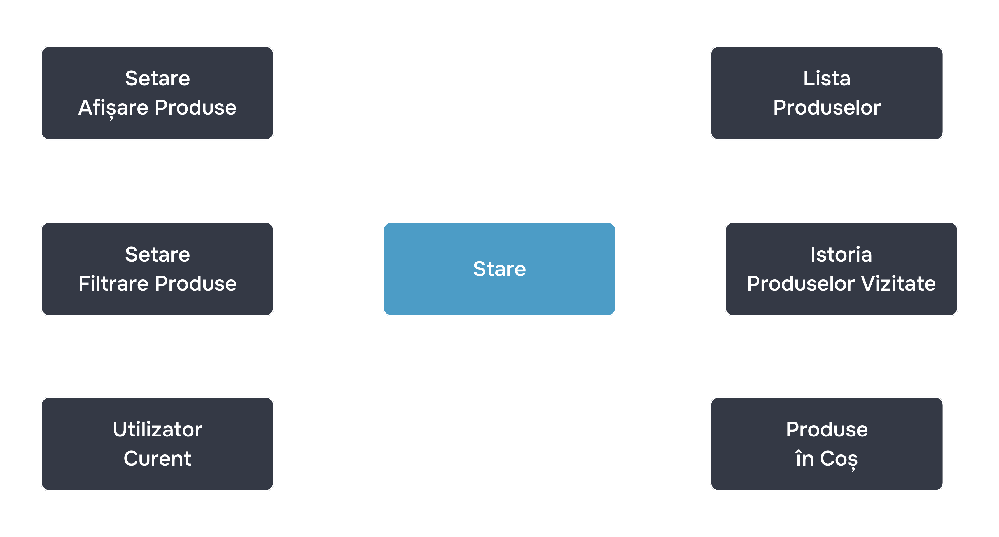

# Starea internă a componentelor

În lecțiile anterioare, ați înțeles componentele și prop-urile lor în React. Deja știți că puteți influența logica de funcționare și afișarea componentelor prin intermediul prop-urilor. În React, există încă un instrument pentru a influența componenta - starea internă a componentei.

Datorită stării, componentele pot reacționa la acțiunile utilizatorului, răspunsurile serverului și alte evenimente, fără a încălca principiul de puritate al componentelor. Dar să începem cu noțiunile de bază - vă vom explica ce este starea internă a componentelor în React.

## Ce este starea internă

Starea ne înconjoară în viața de zi cu zi: computerul este **pornit**, ora din zi este **seara**, muzica este **în redare**. În interfețele utilizator, la fel ca la componente și la aplicațiile create cu ajutorul lor, de asemenea, poate exista o stare: meniul este **desfășurat**, tema întunecată este **activată**, utilizatorul este **autentificat**, datele sunt **încărcate**.

Într-un magazin online, lista de produse, conținutul coșului, prezența comenzilor active, filtrele aplicate și codul promoțional - toate acestea sunt stări.



Ea se poate schimba în funcție de acțiunile utilizatorului și de procesele interne ale aplicației, iar aceste schimbări influențează logica de funcționare și afișarea interfeței utilizatorului. Biblioteca React oferă un set puternic de instrumente pentru gestionarea stării interne a componentelor și construirea de interfețe utilizator dinamice.

## Starea în componentele React

În React, starea internă a unei componente de clasă este stabilită prin proprietatea `state`. Componenta se re-renderează atunci când `state` se schimbă. Starea este foarte asemănătoare cu prop-urile, cu excepția faptului că este stabilită în interiorul componentei, nu vine din exterior. Mai târziu vom arăta cum `state` și `props` lucrează împreună.

Iată un exemplu de componentă cu stare internă:

```javascript
class ThemeToggle extends React.Component {
	state = { theme: "light" };

	render() {
		return (
			<div>
				<p>Theme {this.state.theme} is enabled</p>
			</div>
		);
	}
}
```

Componenta conține o stare: `{ theme: "light" }`. Bazându-ne pe această stare, putem crea lucruri uimitoare, de exemplu, putem adăuga o temă întunecată în aplicație:

```javascript
class ThemeToggle extends React.Component {
	state = { theme: "light" };

	render() {
		return (
			<div className={this.state.theme === "light" ? "th-light" : "th-dark"}>
				<p>Theme {this.state.theme} is enabled</p>
			</div>
		);
	}
}
```

În acest exemplu, se aplică o clasă diferită elementului `div` în funcție de valoarea `this.state.theme`. Iar această clasă, la rândul său, influențează schema de culori.

## Ierarhia și forma stării în componentele React

La fel ca `props`, `state` poate fi ierarhic și poate lua orice formă:

```javascript
state = {
	theme: "light",
	posts: [
		{ id: 1, title: "News 1" },
		{ id: 2, title: "News 2" },
	],
	commentsEnabled: true,
	user: {
		name: "Huckleberry Finn",
		uuid: "123e4567-e89b-12d3-a456-426655440000",
		lastActive: 1614498769824,
	},
};
```

În acest exemplu, în `state` se păstrează informații despre tema aplicată în aplicație și utilizatorul curent - numele său, identificatorul, timpul ultimei activități, setarea disponibilității comentariilor, lista de știri. Obiectul `state` poate fi folosit pentru a descrie orice „model de date” pe care îl permite imaginația.

În lecția următoare, vom discuta cum să influențăm această stare și vom examina cum `state` și `props` lucrează împreună.
