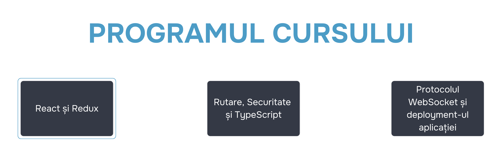

# Programul cursului

Cursul este compus din trei module, fiecare cu durata de două sprinturi. Pentru a vă orienta mai ușor, am desenat o hartă spațială (în toate sensurile) a programului:

## Modulul 1. React și Redux
În acest modul, am adunat tot ce trebuie să știți despre React la început: de la istoria creării până la toată funcționalitatea necesară a bibliotecii. Veți crea un prototip simplu de aplicație React folosind CRA și veți învăța cum să îl depanați utilizând pluginul React DevTools. Veți afla ce înseamnă „starea” în terminologia cadrelor moderne și bibliotecilor. Veți învăța să lucrați cu una dintre cele mai populare biblioteci pentru stocarea stării - Redux.

## Modulul 2. Rutare, securitate și TypeScript
În acest modul, vă vom arăta cum să configurați rutarea într-o aplicație SPA și să creați rute dinamice. Veți învăța să lucrați cu principalele hook-uri în React Router. După aceea, veți studia procesele de autentificare și autorizare ale utilizatorilor - aceasta vă va ajuta să asigurați că doar utilizatorii autorizați au acces la anumite acțiuni și pagini ale aplicației. Apoi, veți trece la fundamentalele TypeScript și veți învăța cum să îl utilizați în aplicațiile React.

## Modulul 3. Protocolul WebSocket și deployment-ul aplicației
Vă veți finaliza studiul TypeScript-ului prin tipizarea Redux. După aceea, veți implementa o conexiune cu serverul în timp real utilizând protocolul WebSocket. Apoi, veți cunoaște abordările de testare și veți afla mai multe despre testarea automatizată a aplicației. De asemenea, veți învăța cum să faceți deploy la aplicația gata făcută.
