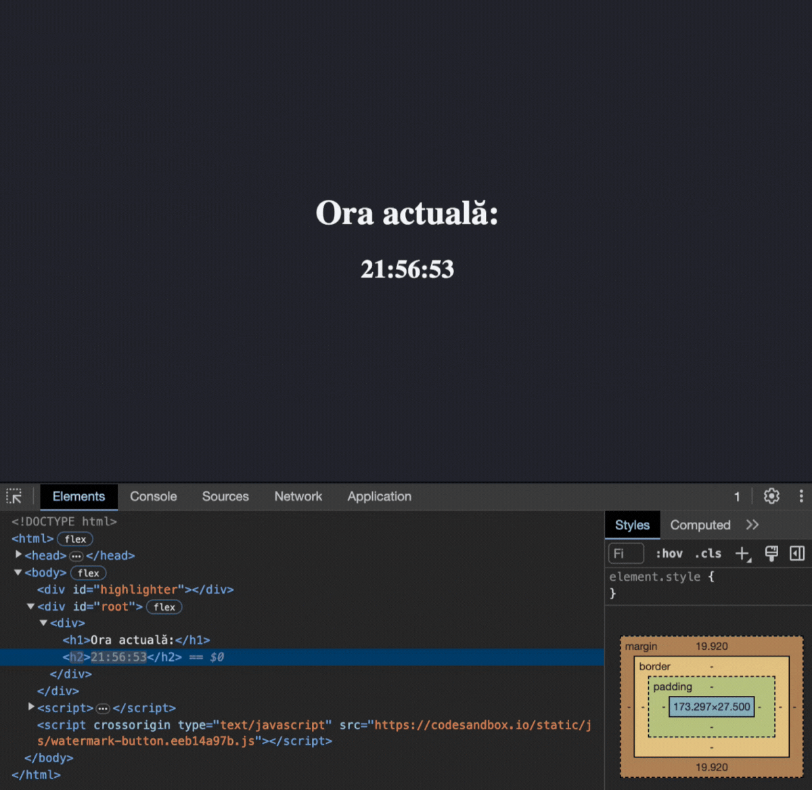

 
 # Rendering în React

Din lecția anterioară, ați învățat cum să conectați React și să începeți să-l folosiți. Acum vă vom spune cum se realizează renderingul și cum marcajul din codul React ajunge în HTML.
React în browser
Am apelat deja funcția <mark>ReactDOM.render</mark>. Acesta este punctul de plecare pentru orice proiect web pe React. Să reamintim cum arată:

```javascript
const root = ReactDOM.createRoot(document.querySelector('#root'));
root.render(
  React.createElement("h1", null, "Salut, React!")
);
```

Funcția primește un singur argument - marcajul pe care dorim să-l plasăm în nodul rădăcină.

Să analizăm mai detaliat acest lucru. 
Este apelul unei alte funcții <mark>React.createElement</mark>, dar din biblioteca <mark>react</mark>. 
Ea este apelată cu trei argumente:

- Numele tagului HTML rezultat.
- Proprietăți suplimentare atașate acestui tag. Aceasta poate fi un identificator CSS class sau id sau alte proprietăți.
- Conținutul care va intra în tagul HTML. În acest caz, este șirul "Salut, React!". Conținutul poate fi nu doar text, ci și alte elemente.

După al treilea argument pot urma și altele. 
Toate vor fi adăugate unul după altul în interiorul elementului creat, ca și cum am folosi metoda <mark>appendChild</mark>. 

În lecțiile următoare, vom vorbi mai detaliat despre argumente și caracteristicile lor, precum și despre moștenirea și încorporarea elementelor.

Dar să examinăm un exemplu:

```javascript
const root = ReactDOM.createRoot(document.querySelector('#root'));
root.render(
  React.createElement(
    "div",
    null,
    React.createElement("h1", null, "Ora actuală:"),
    React.createElement("h2", null, new Date().toLocaleTimeString())
  )
);
```

Acest cod va afișa în nodul rădăcină următoarea marcă:
```html
<div>
    <h1>Ora actuală:</h1>
    <h2>11:54:14</h2>
</div>
```

Dacă reîmprospătați pagina, temporizatorul va afișa de fiecare dată un timp nou. Desigur, un site care necesită ca utilizatorul să apese constant F5, probabil că nu va deveni popular.

Aplicațiile reale pot consta din zeci de mii de elemente. În cazul schimbării unui element de nivel superior, toți descendenții săi vor fi redesenați. Din păcate, browserele sunt construite astfel încât manipulările cu DOM sunt procese consumatoare de resurse pentru dispozitivele utilizatorilor. În acest caz, sarcina asupra procesorului, memoriei RAM și bateriei va crește semnificativ.

Cum rămâne React atât de rapid în aceste condiții? Totul se datorează mecanismelor de optimizare inteligente din interiorul bibliotecii și VirtualDOM. React încearcă să schimbe doar acea parte a marcării care este necesară și să nu atingă restul DOM-ului.

Să extindem exemplul anterior pentru ca actualizarea temporizatorului să se facă fără reîncărcarea paginii:

```javascript
const root = ReactDOM.createRoot(document.getElementById('root'));
function timer() {
    const element = React.createElement(
        "div",
        null,
        React.createElement("h1", null, "Ora actuală:"),
        React.createElement("h2", null, new Date().toLocaleTimeString())
    );
    root.render(element);
}

setInterval(timer, 1000);
```

Acum, o dată pe secundă, va fi apelată funcția <mark>timer</mark>, a cărei sarcină este să redea arborele DOM din câteva noduri. 
S-ar părea că toate elementele arborelui vor fi redate din nou, o dată pe secundă, dar nu este așa. 

Iată ce se întâmplă de fapt:



Doar elementul <mark>h2</mark>, care conține <mark>new Date().toLocaleTimeString()</mark>, este actualizat, iar restul elementelor arborelui nu sunt redesenate. ReactDOM compară elementul și arborele său copil cu versiunea anterioară și face în DOM doar schimbările necesare.

Elementele React sunt imuabile: după crearea unui element, nu este posibil să-i schimbați descendenții sau atributele. Imutabilitatea permite doar recrearea elementelor, ceea ce ajută la eliminarea multor erori care apar în crearea interfețelor utilizator. În React, un element poate fi considerat ca un cadru de film: reflectă starea interfeței la un moment dat. În cadrul acestui curs, veți întâlni de mai multe ori imutabilitatea.

Deja cunoașteți o modalitate de a actualiza interfața - creând un nou element prin <mark>render</mark>. 
În practică, majoritatea aplicațiilor scrise în React apelează <mark>render</mark> doar o dată - la inițializare.

În acest curs, veți învăța și alte modalități de a influența interfața.

În lecția următoare, vom vorbi despre mecanismul care permite actualizarea doar a elementului HTML schimbat - VirtualDOM.